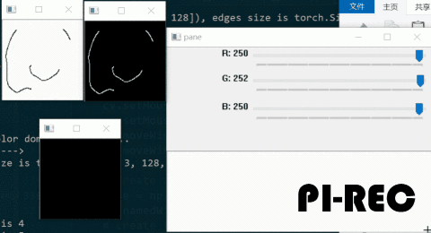
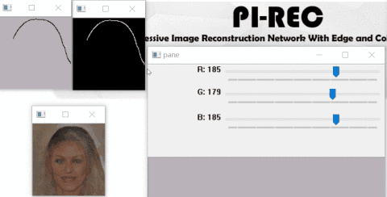

PI-REC     (WIP)
------------------------------------------------------------------------------------------------------
<p align="left">
		
		
		
		
		
</p>

**Progressive Image Reconstruction Network With Edge and Color Domain** <br>

### [Paper]() | [BibTex](#citation)

-----

<p align="center">

</p>

<p align="center">
    <em>When I was a schoolchild, </em>
</p>
<p align="center">
    <em>I dreamed about becoming a painter. </em>
</p>
<p align="center">
    <em>With PI-REC, we realize it nowadays. </em>
</p>
<p align="center">
    <em>For you, for everyone.</em>
</p>

-----
<br>
<br>
<p align="center"><b>English | <a href="#jump_zh">中文版</a></b> 
</p>
<br>

🏳️‍🌈 Demo show time 🏳️‍🌈
------
#### Draft2Painting
<p align="center">

</p>
<p align="center" class="third">


</p>

#### Tool operation
<p align="center" class="half">
   

</p>

<br>
<br>

Introduction
-----

We propose a universal image reconstruction method to represent detailed images purely from binary sparse edge and flat color domain.
Here is the open source code and the drawing tool.<br>
*\*The codes of training for release are no completed yet, also waiting for release license of lab.* <br>   
**Find more details in our paper: [Paper on arXiv]()**<br>
<br>

Quick Overview of Paper
-----

### What can we do?
<p align="center">
   
</p> 

- Figure (a): Image reconstruction from extreme sparse inputs.<br>
- Figure (b): Hand drawn draft translation.<br>
- Figure (c): User-defined edge-to-image **(E2I)** translation.<br>
<br>

### Model Architecture
We strongly recommend you to understand our model architecture before running our drawing tool. Refer to the paper for more details.<br>

<p align="center">
   
</p>

## <span id='pre'>Prerequisites</span>
- Python 3+
- PyTorch `1.0` (`0.4` is not supported)
- NVIDIA GPU + CUDA cuDNN

## <span id='ins'>Installation</span>
- Clone this repo
- Install PyTorch and dependencies from http://pytorch.org
- Install python requirements:
```bash
pip install -r requirements.txt
```

## <span id='usage'>Usage</span>
#### We provide two ways in the project:
- **Basic command line mode** for batch test  
- **Drawing tool GUI mode** for creation

Firstly, follow steps below to prepare pre-trained models with patience:
1. Download the pre-trained models you want here: <a href="https://drive.google.com/open?id=1Oc-MZ0O2sZszes2_QF12dflDp6uIBpGR" target="_blank">Google Drive</a> | <a href="https://pan.baidu.com/s/1oX7ckJrOozA7oYwzeFHhSA" target="_blank">Baidu</a> (Extraction Code: 9qn1)
2. Unzip the `.7z` and put it under your dir `./models/`.<br>
So make sure your path now is: `./models/celeba/<xxxxx.pth>`
3. Complete the above [Prerequisites](#pre) and [Installation](#ins)

#### Files are ready now! Read the [User Manual](USAGE.md) for firing operations.

<br>
<br>
<br>

<span id="jump_zh">中文版介绍 :mahjong: </span>
-----
TODO


Acknowledgment
-----
Code structure is modified from [Anime-InPainting](https://github.com/youyuge34/Anime-InPainting), which is based on [Edge-Connect](https://github.com/knazeri/edge-connect).

<span id="citation"> BibTex </span>
-----
