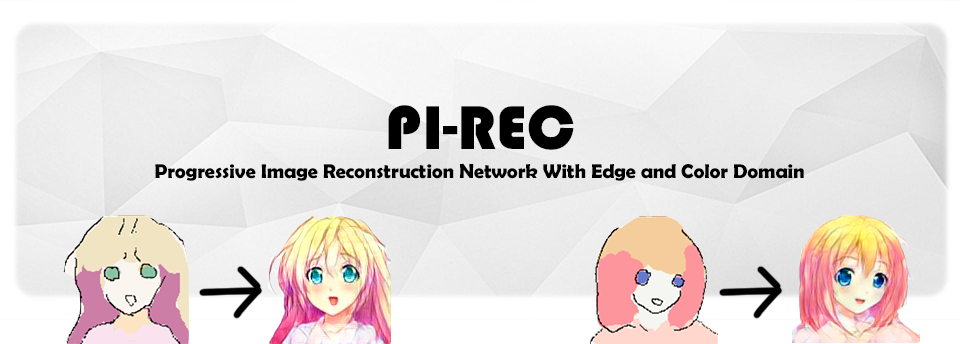
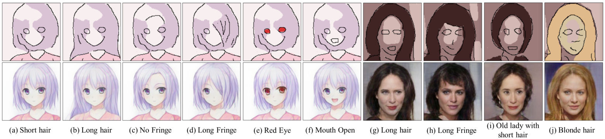
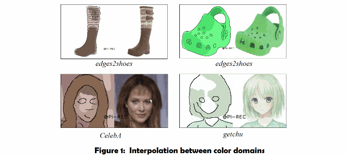
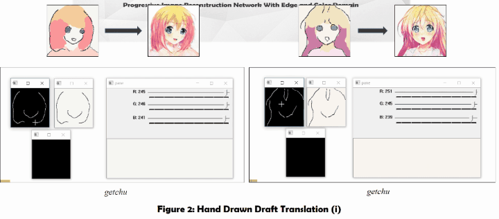
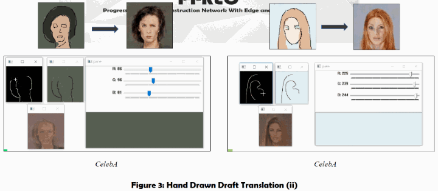
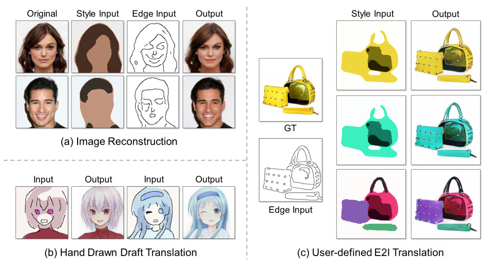
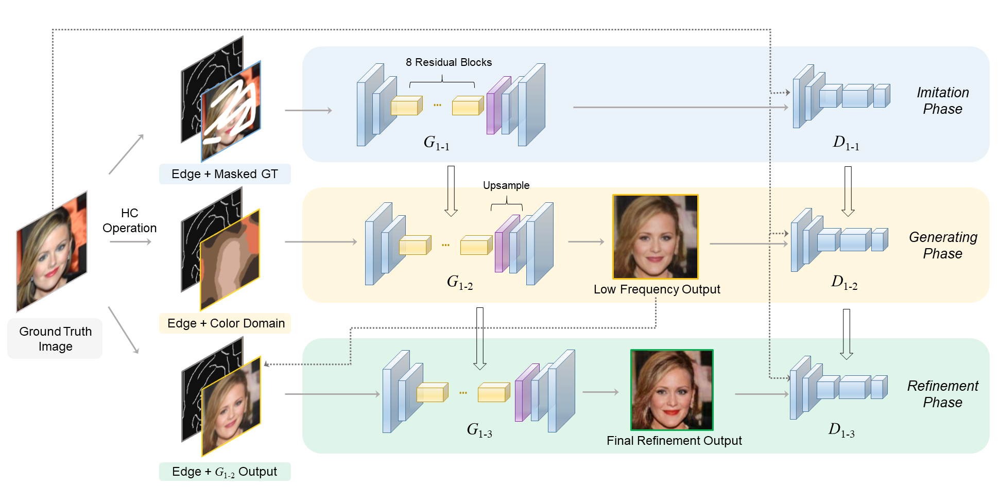

PI-REC     
------------------------------------------------------------------------------------------------------
<p align="left">
		
		
		
		
		 
		<a href="https://paperswithcode.com/sota/image-reconstruction-edge-to-shoes?p=pi-rec-progressive-image-	reconstruction-1"></a>	
</p>

**Progressive Image Reconstruction Network With Edge and Color Domain** <br>

### [Paper on arXiv](https://arxiv.org/abs/1903.10146) | [Paper Read Online](https://www.arxiv-vanity.com/papers/1903.10146/) | [BibTex](#citation)

-----

<p align="center">

</p>

<p align="center">
    <em>When I was a schoolchild, </em>
</p>
<p align="center">
    <em>I dreamed about becoming a painter. </em>
</p>
<p align="center">
    <em>With PI-REC, we realize our dream. </em>
</p>
<p align="center">
    <em>For you, for everyone.</em>
</p>

-----
<br>
<br>
<p align="center"><b>English | <a href="#jump_zh">中文版</a></b> 
</p>
<br>

🏳️‍🌈 Demo show time 🏳️‍🌈
------
#### Draft2Painting
<p align="center">

</p>
<p align="center" class="third">

</p>

#### Tool operation
<p align="center" class="half">
   
</p>
<p align="center" class="half">
   
</p>
<br>
<br>

Introduction
-----

We propose a universal image reconstruction method to represent detailed images purely from binary sparse edge and flat color domain.
Here is the open source code and the drawing tool.
Learn more about related works here --> [image-to-image papers collection](https://github.com/lzhbrian/image-to-image-papers).<br>

*\*The codes of training for release are no completed yet, also waiting for release license of lab.* <br>   
**Find more details in our paper: [Paper on arXiv](https://arxiv.org/abs/1903.10146)**<br>
<br>

Quick Overview of Paper
-----

### What can we do?
<p align="center">
   
</p> 

- Figure (a): Image reconstruction from extreme sparse inputs.<br>
- Figure (b): Hand drawn draft translation.<br>
- Figure (c): User-defined edge-to-image **(E2I)** translation.<br>
<br>

### Model Architecture
We strongly recommend you to understand our model architecture before running our drawing tool. Refer to the paper for more details.<br>

<p align="center">
   
</p>

## <span id='pre'>Prerequisites</span>
- Python 3+
- PyTorch `1.0` (`0.4` is not supported)
- NVIDIA GPU + CUDA cuDNN

## <span id='ins'>Installation</span>
- Clone this repo
- Install PyTorch and dependencies from http://pytorch.org
- Install python requirements:
```bash
pip install -r requirements.txt
```

## <span id='usage'>Usage</span>
#### We provide two ways in this project:
- **Basic command line mode** for batch test  
- **Drawing tool GUI mode** for man-machine interactive creation

Firstly, follow steps below with patience to prepare pre-trained models:
1. Download the pre-trained models you want here: <a href="https://drive.google.com/open?id=1Oc-MZ0O2sZszes2_QF12dflDp6uIBpGR" target="_blank">Google Drive</a> | <a href="https://pan.baidu.com/s/1oX7ckJrOozA7oYwzeFHhSA" target="_blank">Baidu</a> (Extraction Code: 9qn1)
2. Unzip the `.7z` and put it under your dir `./models/`.<br>
So make sure your path now is: `./models/celeba/<xxxxx.pth>`
3. Complete the above [Prerequisites](#pre) and [Installation](#ins)

#### Files are ready now! Read the [User Manual](USAGE.md) for firing operations.

<br>
<br>
<br>

<span id="jump_zh">中文版介绍 :mahjong: </span>
-----

Demo演示
-----
自己看上面的咯~

简介
-----

我们提出了一种基于GAN的渐进式训练方法 PI-REC，它能从超稀疏二值边缘以及色块中还原重建真实图像。
我们的论文重心是在超稀疏信息输入的还原重建上，并非自动绘画。
总之，PI-REC论文/项目属于*图像重建，图像翻译，条件图像生成，AI自动绘画*的前沿交叉领域的最新产出，而非简单的以图搜图等等。阅读论文中的
Related Work部分或 [image-to-image论文整合项目](https://github.com/lzhbrian/image-to-image-papers)以了解更多。<br>
**注意**：这里包含了论文代码以及交互式绘画工具。此论文demo仅推荐给不会绘画的人试玩（比如我），或给予相关领域科研人员参考。远远未达到民用或辅助专业人士绘图的程度。<br>
<br>
*\*由于训练过程过于复杂，用于训练的发布版代码还未完成* <br>   
**在我们的论文中你可以获得更多信息: [Paper on arXiv (推荐)](https://arxiv.org/abs/1903.10146) | [机器之心-中文新闻稿](https://www.jiqizhixin.com/articles/2019-04-03-4)** | **[b站中文视频教程(有福利?)](https://www.bilibili.com/video/av48420057/)**
<br>
<br>

论文概览
-----

### PI-REC能做啥？
<p align="center">
   
</p> 

- Figure (a): 超稀疏输入信息重建原图。<br>
- Figure (b): 手绘草图转换。<br>
- Figure (c): 用户自定义的 edge-to-image **(E2I)** 转换.<br>
<br>

### 模型结构
我们强烈建议你先仔细阅读论文熟悉我们的模型结构，这会对运行使用大有裨益。
<p align="center">
   
</p>

## 基础环境
- Python 3
- PyTorch `1.0` (`0.4` 会报错)
- NVIDIA GPU + CUDA cuDNN （当前版本已可选cpu，请修改`config.yml`中的`DEVICE`）

## 第三方库安装
- Clone this repo
- 安装PyTorch和torchvision --> http://pytorch.org
- 安装 python requirements:
```bash
pip install -r requirements.txt
```

## <span id='usage_zh'>运行使用</span>
#### 我们提供以下两种方式运行：
- **基础命令行模式** 用来批处理测试整个文件夹的图片 
- **绘画GUI工具模式** 用来实现交互式创作

首先，请耐心地按照以下步骤做准备：
1. 在这里下载你想要的预训练模型文件：<a href="https://drive.google.com/open?id=1Oc-MZ0O2sZszes2_QF12dflDp6uIBpGR" target="_blank">Google Drive</a> | <a href="https://pan.baidu.com/s/1oX7ckJrOozA7oYwzeFHhSA" target="_blank">Baidu</a> (提取码: 9qn1)
> 更新：2021.4 baidu网盘和谐了我的权重文件，已无法分享，请自行前往Google drive~
3. 解压，放到目录`./models`下<br>
现在你的目录应该像这样： `./models/celeba/<xxxxx.pth>`
3. 完成上面的基础环境和第三方库安装

#### 啦啦啦啦，到这里准备工作就完成啦，接下来需要阅读[用户手册](USAGE.md#jump_zh)来运行程序~

<br>
<br>

------

Acknowledgment
-----
Code structure is modified from [Anime-InPainting](https://github.com/youyuge34/Anime-InPainting), which is based on [Edge-Connect](https://github.com/knazeri/edge-connect).

<span id="citation"> BibTex </span>
-----
```
@article{you2019pirec,
  title={PI-REC: Progressive Image Reconstruction Network With Edge and Color Domain},
  author={You, Sheng and You, Ning and Pan, Minxue},
  journal={arXiv preprint arXiv:1903.10146},
  year={2019}
}
```
