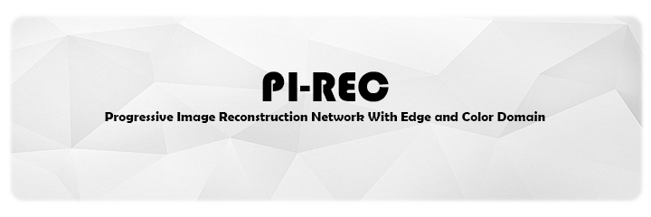
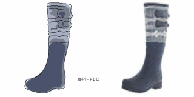
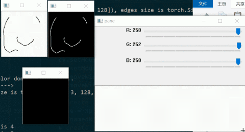
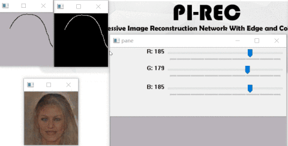

PI-REC     (WIP)
------------------------------------------------------------------------------------------------------

		
		
		
		
		

### Progressive Image Reconstruction Network With Edge and Color Domain     

[arXiv]() | [BibTex](#citation)

-----

    <em>When I was a schoolchild, </em>

    <em>I dreamed about becoming a painter. </em>

    <em>With PI-REC, we realize it nowadays. </em>

    <em>For you, for everyone.</em>

-----

English | [中文版介绍](#jump_zh)     

🏳️‍🌈 Demo show time 🏳️‍🌈
------
#### Draft2Painting

#### Tool operation

   

Introduction
-----

We propose a universal image reconstruction method to represent detailed images purely from binary sparse edge and color domain.     
Find more details in our paper: [arXiv]()

中文版介绍🇨🇳 
-----
 BibTex 
-----

