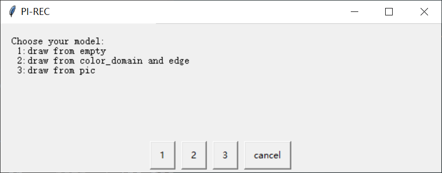
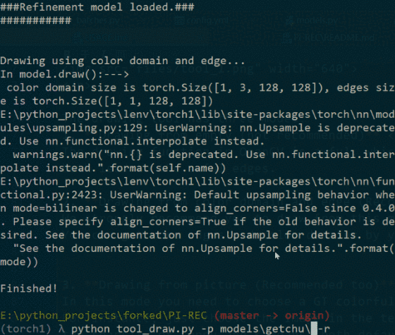
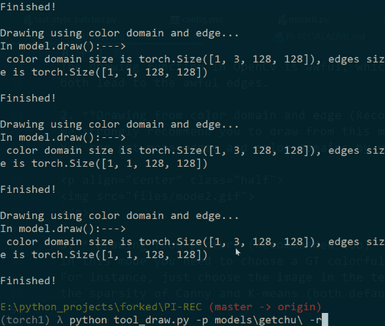

User Manual of PI-REC
---------------
<p align="left">
		
		
		
		
		
</p>

*\*The codes of training for release are no completed yet, also waiting for release license of lab.* 
<br>   
**English | [中文版](#jump_zh)**


## Introduction
#### We provide two ways in the project:
1. **Basic command line mode** for batch test  
2. **Drawing tool GUI mode** for creation

In short, each model has its own directory, which contains option file `config.yml` and model weights files `xxx.pth`.
We assume that you have finished the preparing steps in [README](README.md#usage).

## Check files
Make sure that your model dir like this (e.g. the `celeba model`):<br>
- `./models/celeba/config.yml` for the configuration
- `./models/celeba/G_Model_gen_xxxxxx.pth` for *2nd Generating Phase* of paper
- `./models/celeba/R_Model_gen_xxxxxx.pth` for *3rd Refinement Phase* of paper

If you cannot catch on *Xxxx Phase* above, read our paper thoroughly first.

## Dataset for Test
For convenience, we provide a zip file containing test images of 4 datasets. It is mainly for **Command Line Mode** to do the reconstruction tests.<br>
1. Download --> [Google](https://drive.google.com/open?id=12TXQOWH_wcNGF9yiRDiBqRO0c1oOAWcs) | [Baidu](https://pan.baidu.com/s/1SdI0peZkY3_tnl9vVulF6A) (Extraction Code: rr8u) <br>
2. Unzip the file and make sure your path now is like: `./datasets/celeba/val`

## 1.Command Line Mode
This mode is to show powerful reconstruction ability of PI-REC.
During this mode, PI-REC will automatically extract edges and color domains from GT. 
So, just put the original GT validation dataset under the directory, like the testing datasets we provide above.

Phase | Command | Dataset loc | Description
-----|-------|------|-------
 *2nd* | python test.py -p models/celeba | `TEST_FLIST` in `config.yml` |  Reconstruct image using edge and color domain extracted from GT
 *3rd* | python refine.py -p models/celeba | `REFINE_FLIST` in `config.yml` |  Refine all the images (outputs from *2nd Phase*) 
 *2nd + 3rd* | python test_with_refine.py -p models/celeba | `TEST_FLIST` in `config.yml` |  Reconstruct and refine

- In the `config.yml` of the corresponding model, `TEST_FLIST` and `REFINE_FLIST` are most important option to define the testing dataset location.<br>
- Optional changeable options: `DEBUG`, `INPUT_SIZE`, `SIGMA` and `KM`. Refer to the `config.yml` for details.

## 2.Drawing GUI Mode
This mode is a simple interactive demo written by OpenCV and easygui, which has been shown before.<br><br>
**IMPORTANT**: The OpenCV window size of 128 is too small to draw, you can use mouse to resize  the drawing or output window.

```bash
python tool_draw.py -p models/celeba -r
```

Command | Meaning
------|-------
`-p` or `--path` | The model dir path to load.
`-r` or `--refinement` | Load the *Refinement Phase* if added manually. (Need `R_Model_gen_xxx.pth`)
`-c` or `--canny` | *Hyperparameter:* sigma of canny (default=3)
`-k` or `--kmeans` | *Hyperparameter:* color cluster numbers of kmeans (default=3)

If everything is loaded successfully, a window will show as below:
 
<p align="center">

</p>

The drawing tool has three modes:
1. **Drawing from empty (not recommended)** <br> 
The drawing function in OpenCV is awful, which is not suitable for painting. The moving speed of mouse will affect the line quality. Drawing edge too fast or too slow will
both lead to the awful edges.

2. **Drawing from color domain and edge (Recommended).** <br>
We strongly recommend you to start drawing using this mode. Some anime edges and color domains are provided drawn by myself in `./examples/getchu`. If you use examples from `./examples/getchu`, you need to run the corresponding command:  
  ```bash
  python tool_draw.py -p models/getchu-anime -r   
  ```
You can also get more edges and color domains by yourself using the **Command Line Mode** above. The testing results contain extracted edges and color domains by default (`DEBUG: 1` in `config.yml`). If you are not interested in the edges and color domains drawn by myself, using the edges and color domains from testing results may be a good choice.


<p align="center">
   
</p>

3. **Drawing from picture (Recommended too)**<br>
In this mode you need to choose a GT colorful image, then its edge and color domain will be auto-extracted, which is greatly convenient. <br>
For instance, just choose the image in the testing datasets. Optionally, use the command line parameter `-c` and `-k` to control
the sparsity of Canny and K-means (both default=3).

<p align="center">
   
</p>

Four windows will show up, one for color domain, one for edge, one for output and a pane. Switch your typewriting into ENG first.

**Please read the instructions below carefully**

(***Note that***: at the beginning, the output window is dark, you can press the keyboard ` g ` for the initial generated output. 
In the subsequent drawing process, press the keyboard ` g ` to view the real-time output changes based on *2nd Generating Phase*. If you think the window size is too small to draw, you can use the mouse to resize the drawing and output window.)

Key | Description
-----|------
Mouse `Left` | Draw, or erase when in eraser mode
Mouse `Right` | Erase
Key `e` | To toggle eraser mode on or off, the explanation is shown [here](https://github.com/youyuge34/PI-REC/pull/16) 
Key `h` | To show the help message box.
Key `[` | To make the brush thickness smaller
Key `]` | To make the brush thickness larger
Key `g` | To reconstruct the image from edge and color domain
Key `u` | To refine the output only when `-r` is added in command line
Key `Alt` | To absorb mouse pointer color in color domain (the mouse must be moving at the same time)
Key `l` | To make the output lighter (can be pressed continuously) 
Key `x` | To save the binary edge
Key `c` | To save the color domain
Key `s` | To save the output
Key `q` | To quit

<br>
<br>
<br>

<span id="jump_zh">使用手册 :mahjong: </span>
------
## 简介
#### 我提供以下两种方式运行:
1. **基础命令行模式** 用来批处理测试整个文件夹的图片 
2. **绘画GUI工具模式** 用来进行交互式的创作

记住，每个模型有它自己的单独文件夹，里面包含了该模型自己相应的配置文件`config.yml`和模型权重文件`xxx.pth`。
我们假定你已经完成了README里的准备工作。

## 检查模型文件
保证你的文件目录如下 (假设我们使用 `celeba model`):<br>
- `./models/celeba/config.yml` 是配置文件
- `./models/celeba/G_Model_gen_xxxxxx.pth` 对应论文里的 *2nd Generating Phase* 
- `./models/celeba/R_Model_gen_xxxxxx.pth` 对应论文里的 *3rd Refinement Phase* 

啥？你问我*xxx Phase*是啥意思？自己先回去看论文！


## 测试用数据集
为了方便测试，这里我们打包了4个数据集对应的测试图片集，主要是为了**命令行模式**。
1. 下载--> [Google](https://drive.google.com/open?id=12TXQOWH_wcNGF9yiRDiBqRO0c1oOAWcs) | [Baidu](https://pan.baidu.com/s/1SdI0peZkY3_tnl9vVulF6A) (提取码: rr8u) <br>
2. 解压，现在你的文件夹路径应该是：`./datasets/celeba/val`


## 1.命令行模式...启动！
整个模式是为了复现论文PI-REC中面对稀疏输入的超强重建能力。在这个模式下，PI-REC
会自动从原图中抽取出边缘和色块（根据`config.yml`里的参数）。
所以，用我们上面提供的测试数据集，把原图放进去就行了，不用你自己抽取边缘和色块。


阶段 | 命令行 | 测试使用的图片文件夹位置 | 说明
-----|-------|------|-------
 *2nd* | python test.py -p models/celeba | `TEST_FLIST` in `config.yml` |  Reconstruct image using edge and color domain extracted from GT
 *3rd* | python refine.py -p models/celeba | `REFINE_FLIST` in `config.yml` |  Refine all the images (outputs from *2nd Phase*) 
 *2nd + 3rd* | python test_with_refine.py -p models/celeba | `TEST_FLIST` in `config.yml` |  Reconstruct and refine

- 在模型对应的`config.yml`中，`TEST_FLIST` 和 `REFINE_FLIST` 决定了测试数据集的位置，是最重要的参数。
- （可选）可改的配置参数：`DEBUG`, `INPUT_SIZE`, `SIGMA` 和 `KM`. 具体含义请看`config.yml`。

## 2.绘画GUI工具模式
我们使用`OpenCV`和`easygui`做了一个简单的交互式绘图demo，`README`中已经展示过了。
此论文demo仅推荐给不会绘画的人试玩（比如我），远远未达到辅助专业人士绘图的程度。<br>
<br>
**重要**： 尺寸为128的OpenCV窗口太小了，不好绘画，建议使用鼠标来调整绘图与输出窗口大小。

```bash
python tool_draw.py -p models/celeba -r
```

命令参数 | 含义
------|-------
`-p` or `--path` | 读取的模型位置
`-r` or `--refinement` | 手动加上这个才会读取 *Refinement Phase*  (需要 `R_Model_gen_xxx.pth`)
`-c` or `--canny` | *超参数：* sigma of canny (default=3)
`-k` or `--kmeans` | *超参数：* color cluster numbers of K-means (default=3)

如果一切运行顺利，会显示以下窗口界面：
<p align="center">

</p>

**绘画GUI工具自带三种启动模式:**
1. **从0开始 (不推荐)** <br> 
因为OpenCV的绘画函数实在是太糟糕了，基本就是死循环里判断鼠标位置然后上色……画得太快或者太慢
都会让线条很差，而模型是很看重线条质量的。所以可以多看看canny算法抽出来的和我画的线条是咋样的。

2. **从 边缘和色块 开始(推荐)** <br>
我们强烈推荐你从这个开始绘画。`./examples/getchu`文件夹下包含了我画的一些线条和色块素材可以直接读取使用。 
**注意**：如果使用的是`./examples/getchu`文件夹中样例，需要使用对应的命令语句。
```bash
python tool_draw.py -p models/getchu-anime -r  
```
当然，如果你不喜欢我自己画的线条和色块素材，也可以使用上面说的**命令行模式**去获得数据集测试结果，默认的测试输出中是含有自动抽取出的边缘和色块的~
(在 `config.yml`里：`DEBUG: 1` )。可以在这些抽取出的边缘和色块基础上进行创作。

<p align="center">
   
</p>

3. **从一张图片开始 (推荐x2)**<br>
这个模式下，你需要选择一张彩色原图（比如测试数据集里的），然后它的边缘和色块
会被自动抽取出来。使用命令行参数 `-c` 和 `-k`来指定抽取算法Canny和K-means的超参数（默认都是3）。

<p align="center">
   
</p>

<br>

下一步，会有四个窗口出现，分别是**边缘，色块（带边缘的），输出和调色盘**。<br>
在边缘窗口绘画的边缘会实时反馈到色块窗口中，在色块窗口中涂色。<br>

**请仔细阅读下方的按键说明**<br>

(***特别提示***：*开始时output窗口一片漆黑，按键盘 `g`（英文模式下）得到初始输出结果。在后续绘图过程中，按键盘 `g`可以实时查看基于*2nd Generating Phase*的输出结果的变化。如果觉得窗口太小，可以使用鼠标拖动画图和输出窗口的大小* )<br>

按键 | 说明
-----|------
鼠标 `左键` | 绘制
鼠标 `右键` | 清除
键盘 `h` | 显示帮助信息
键盘 `e` | 擦除模式，开启后鼠板左键为擦除功能，添加原因[在此](https://github.com/youyuge34/PI-REC/pull/16)
键盘 `[` | 画笔粗细-1
键盘 `]` | 画笔粗细+1
键盘 `g` | 从边缘和色块重建图像（*2nd Generating Phase*)
键盘 `u` | 精修图像 （*3rd Refinement Phase* 仅当命令行中加了`-r`参数时)
键盘 `Alt` | 吸管：色块窗口中按住Alt移动鼠标可以吸取颜色
键盘 `l` | 输出图片增加亮度（可连续按）
键盘 `x` | 保存边缘图像
键盘 `c` | 保存色块
键盘 `s` | 保存输出
键盘 `q` | 退出

技巧：

- 色块窗口中按住Alt移动鼠标可以吸取颜色。
- 有时简陋稀疏的edge效果更好
